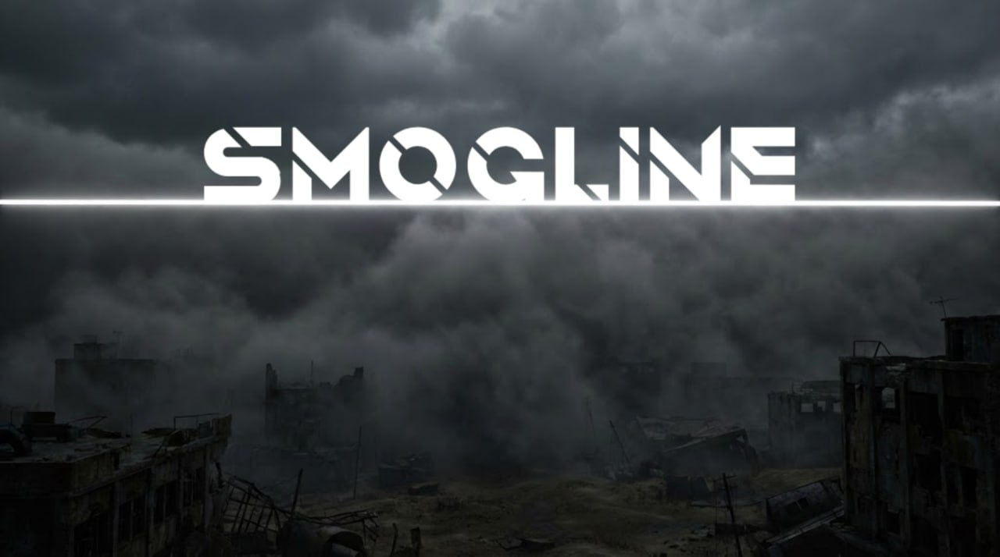

# ☢️ Smogline: The String Collapse

**[ 🇺🇸 English Version / Английская версия ](README.md)**

> **"Границы между 11 измерениями рухнули. Некроз — это не просто пещеры внизу. Это паразитическая реальность, ждущая, когда треснет Мембрана."**

**Smogline** — это хардкорный технический мод для Minecraft 1.20.1 в сеттинге "Научного Постапокалипсиса". Мы объединяем реальную физику (Теорию струн) с органическим ужасом.

---

## 🚧 Статус Релиза: Ожидается

> [!NOTE]
> **На данный момент мод находится в стадии закрытой Pre-Alpha.**
> Мы уделяем особое внимание качеству кода и оптимизации. Публичный релиз на **CurseForge** и **Modrinth** состоится только при переходе на стадию **Beta**.

Хотите следить за новостями, видеть эксклюзивные спойлеры или попасть на закрытый тест?
👉 **[Присоединяйтесь к нашему Discord](https://discord.gg/Hn9vSuKWrh)**

---

## 🌌 Лор и Сеттинг

Вы — био-модифицированный субъект, пробужденный из криостаза после катастрофы.
* **Катастрофа:** Попытка развернуть свернутые измерения привела к "Струнному Коллапсу".
* **Поверхность:** Радиоактивные пустоши, руины и мутировавшая фауна.
* **Мембрана:** Слой сверхплотной материи, заменивший Бедрок. Барьер, отделяющий наш мир от бездны.
* **Некроз (Измерение):** Живое, хаотичное измерение "по ту сторону". Чтобы попасть туда, игроку придется **проломить дно мира**.

---

## ⚙️ Дневник Разработки (Реализовано)

Работа над ядром мода идет полным ходом:

### 1. 🌍 Генерация Мира как в Тектоник
Полная переработка ванильного генератора ландшафта используя алгоритмы *Tectonic*.
* **Эксклюзивные биомы:** Уникальные зоны разной степени загрязнения, с уникальными ресурсами в каждом из них.
* **Атмосфера:** Кастомный туман, цвет неба, блоки поверхности и пост-эффекты пустоши.

### 2. 🌀 Прорыв в Некроз (Новое Измерение
* **Мембрана:** В следствии струнного коллапса весь бедрок был заменён Мембраной, которая в отличии от него не является неразрушимой. С помощью технологий можно пробить брешь в реальности.
* **Переход:** Разрушение Мембраны открывает путь для падения прямо в измерение Некроза (В разработке).

### 3. 🎯 Новый арсенал
Защита базы нового поколения:
* **Турели:** Добавлена первая огнестрельная турель, которая стреляет разными видам снарядов по баллистической траектории, имеет продвинутый ИИ а также умный захват цели.
* **Гранаты:** В моде присутствуют уже несколько видов гранат, включая ядерную. 
* **Мины:** От противопехотных до микроядерных зарядов.
* **Огнестрельное оружие (WIP):** Реализована начальная винтовка, которая стреляет турельными 20-мм снарядами. Является прототипом для добавления другого огнестрельного оружия в будущем.

### 4. 🔩 Кинетическая Энергия
* **Валы и Редукторы:** Визуально достоверная передача крутящего момента.
* **Сцепление:** Позволяет прерывать передачу крутящего момента на последующие элементы
* **Шестерни и ремни (WIP):** Увеличивайте, уменьшайте и меняйте направление крутящего момента с помощью шестерней разного диаметра. Передавайте крутящий момент на паралельные валы с помощью цепного или ремневого соединения. 

### 5. ⚡ Энергосеть
* **Системные ограничения - не предел!:** Полностью кастомная энергосистема написанная с 0, которая поддерживает огромные числа энергии, вплоть до 9,2 квинтиллиона!
* **Совместимость с Forge Energy:** Наша энергия полностью совместима с встроенной энергией Forge, которая является основой для большинства технических модов, например Mekanism. используйте конверторы энергии, чтобы связать 2 разные энергосистемы.
* **Продвинутый контроль энергией:** Режимы работы энергохранилищ, система приоритетов, рубильники, диоды(WIP) - всё это, для самых сложных и разветвлённых энергосистем.

---

## 🔮 План до выхода Беты

* [ ] Полное завершение работы над игровой прогрессией до этапа начала мид гейма.
* [ ] Стабильные версии биомов измерения "Некроз" и механики пробития мембраны.
* [ ] Доработка систем электроэнергии и передачи кинетики, совершенство взаимодействия между ними.
* [ ] Добавление начального арсенала: (огнестрельного оружия, холодного оружия, мин, бомб, гранат и зарядов).
* [ ] Увеличение количества турелей и типов боеприпасов для них.
* [ ] Увеличения разнообразия биомов оверворлда и их доработка. Также планируется ввести механику генерации заброшенных городов.
* [ ] Добавление аномальных сущностей выбравшихся из под мембраны.
* [ ] Ввод системы радиации и радиационного заражения игрока.
* [ ] Добавление брони и модификаций для неё. 

---

## 🤝 Команда

Состав нашей команды разработки:
1. HyperiO - Java разработчик 
2. Razchexlitiel - Java разработчик и ассет дизайнер.

Мы ищем Java разработчиков, Текстурщиков (пиксельные текстуры), 3D Моделлеров(OBJ/Geckolib) и Композиторов(Ambient/Dark Ambient) для ускорения выхода Беты.
Если вы хотите помочь проекту, свяжитесь с нами в Discord.

**Developed by TONG Industries Team.**
